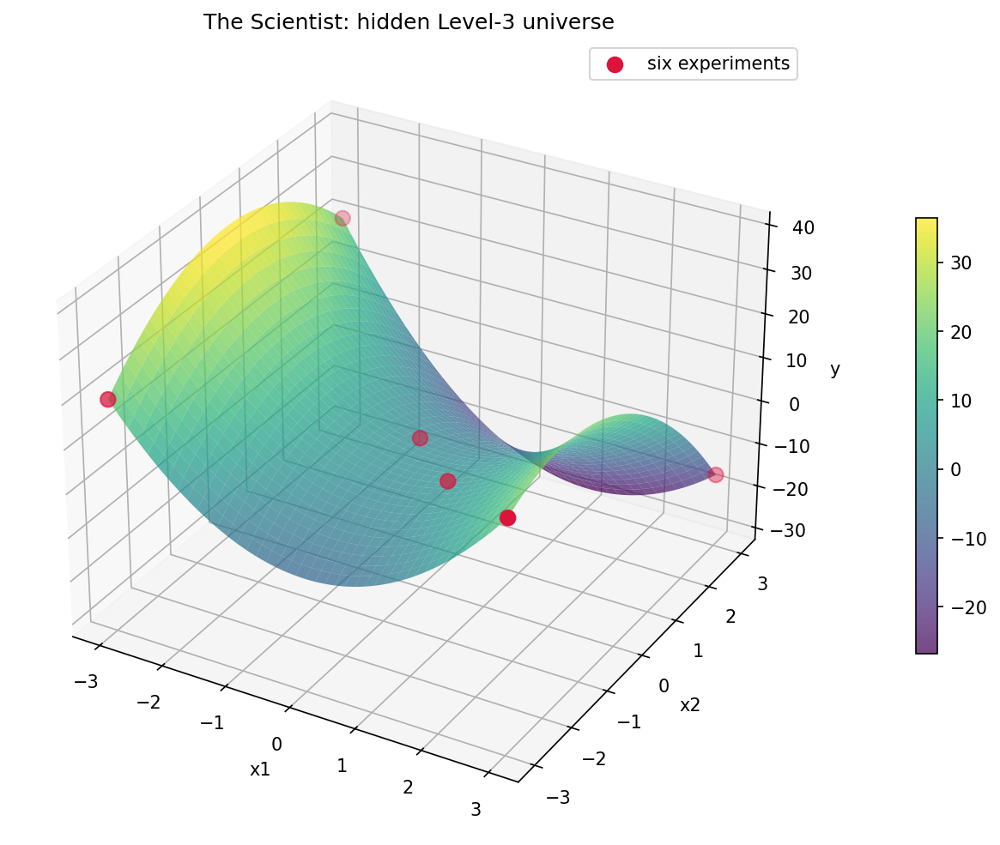

# The Scientist 🔬

> Can outcome-based RL teach a small language model the scientific method?

The model enters a tiny simulated universe whose governing law is hidden. It receives a laboratory, a strict experiment budget, and one job: identify the law.

```text
Hidden from the model: y = 2*x1 + x2**2

EXPERIMENT x1=1 x2=0  -> y=2
EXPERIMENT x1=2 x2=0  -> y=4
EXPERIMENT x1=0 x2=2  -> y=4
...
FINAL {"family":"polynomial","equation":"2*x1 + x2**2","confidence":0.96}
```

The interesting part is not curve fitting. With at most six experiments, the agent must choose measurements that separate its remaining hypotheses, revise its beliefs, and only then propose a law.

## The loop

```text
hypothesize -> design experiment -> observe -> revise belief -> repeat -> propose law
```

Every episode is procedurally generated and automatically scored against hidden probes and the true structure. The primary training run rewards only the final answer; experiment quality is measured, not hand-rewarded. If better scientific behavior emerges, it has to earn its keep through better outcomes.

## Curriculum

1. Linear relationships
2. Polynomial relationships
3. Interaction terms
4. Hidden variables
5. Noisy measurements
6. Competing hypotheses
7. Observation versus intervention

## PrimeRL shape

The environment maps naturally to PrimeRL's environment model: a generated task supplies a hidden universe, a stateful lab tool manages the per-rollout query budget, and an exact rubric scores the final trace. The MVP should use Verifiers' stateful environment interface; the simulator and verifier remain framework-independent so a Verifiers v1 taskset/custom environment adapter can follow without changing the science.

## Notebook and release

- [Run the Colab notebook](./the_scientist_colab.ipynb)
- [View the private Environment Hub release](https://app.primeintellect.ai/dashboard/environments/ritwikraha/the-scientist)
- Pull version `0.2.0` with `prime env pull ritwikraha/the-scientist@0.2.0`



## Quickstart

```bash
cd prime-rl/the-scientist
uv sync --group dev
uv run pytest
uv run python -c 'from the_scientist import load_environment; print(load_environment(level=1))'
```

Run an evaluation after configuring a model provider:

```bash
prime eval run the-scientist -n 10 -r 3

# Raw base models can use the text laboratory without native tool calling.
prime eval run the-scientist -n 10 -r 3 \
  --env-args '{"protocol":"text"}'
```

Environment arguments include `level`, `num_train`, `num_eval`, `seed`, `budget`, `domain_min`, `domain_max`, and `protocol` (`native`, `text`, or `both`).

## Status

**MVP implemented.** Deterministic Levels 1–3, six experiments, safe equation parsing, hidden-probe scoring, and diagnostic metrics are ready for smoke evaluation. Levels 4–7 remain research milestones.

## Research idea

### Question

Can reinforcement learning improve not just a model's final equation, but its ability to choose experiments that efficiently distinguish plausible explanations?

The capability under study has three linked parts:

1. **Hypothesis generation** — maintain plausible laws consistent with evidence.
2. **Experimental design** — choose the next input that maximally separates them.
3. **Belief revision** — discard or update hypotheses after observing a result.

A regression solver addresses only the final fit. The Scientist is an agentic task because information is acquired sequentially and each measurement has an opportunity cost.

### Episode

At the beginning of an episode, the simulator samples a universe from a declared level and split. The model sees variable names, allowed domains, precision, experiment budget, and output format—but never the hidden law, coefficients, seed, candidate set, or held-out probes.

On each turn the model may run one valid experiment or stop early and submit its final law. The laboratory returns only the permitted observation and the number of experiments remaining. After six valid experiments, the model must answer. Invalid or duplicate queries consume budget in the main condition so parser probing is not free.

### Detailed curriculum

| Level | Universe family | Scientific pressure | Success target |
| --- | --- | --- | --- |
| 1 | Affine laws, `y = b + Σ a_i*x_i` | Isolate variables and estimate coefficients | Algebraically equivalent law |
| 2 | Additive polynomials | Detect degree and nonlinear response | Correct terms and coefficients |
| 3 | Polynomial interactions | Distinguish marginal effects from cross-terms | Correct interaction structure |
| 4 | Latent regimes or nuisance variables | Use replication to infer hidden variation | Correct observable distribution and latent-family label |
| 5 | Noisy measurements | Trade breadth for replication; quantify uncertainty | Accurate mean law and noise scale |
| 6 | Deliberately competing hypotheses | Query where candidates disagree most | Select the true family with minimal evidence |
| 7 | Structural causal models | Separate association from causation | Correct interventional predictions and causal structure |

### Identifiability rule

No episode may demand recovery of information that its observation protocol cannot identify. In Level 4, the agent is scored on the observable distribution and recoverable latent structure, not the unknowable value of a hidden variable. In Level 7, the lab explicitly distinguishes `OBSERVE` from `INTERVENE`; causal claims are never scored from observational data alone when multiple causal models remain equivalent.

### Universe generation

Each family has a finite grammar, bounded coefficient set, bounded input domain, and canonical representation. Difficulty is controlled independently through:

- number of variables;
- number and degree of active terms;
- coefficient range and sparsity;
- input domain and measurement precision;
- noise or latent-state entropy;
- similarity among candidate laws;
- experiment budget.

Train, validation, and test splits use disjoint seeds. Stronger out-of-distribution splits also hold out coefficient ranges, equation templates, interaction graphs, or entire combinations of primitives.

### What this is not

- A symbolic-regression benchmark with the full dataset supplied upfront.
- A reward for writing persuasive scientific prose.
- A test of memorizing a small bank of equations.
- A claim that six observations identify arbitrary functions.

The universe grammar is intentionally constrained. The question is whether an agent learns to spend scarce observations intelligently inside that world.

## Method

### Formal task

An episode samples a hidden universe `U` and exposes an input domain `X`. At step `t`, the policy chooses an experiment `x_t ∈ X` and receives `y_t ~ U(x_t)`. After at most `B = 6` experiments it submits a hypothesis `h`. Training maximizes final verification reward, while evaluation measures both correctness and the information efficiency of the chosen sequence.

### Interaction protocol

The native protocol exposes one stateful tool:

```json
{
  "name": "experiment",
  "arguments": {"x1": 1, "x2": 0}
}
```

The response is deliberately narrow:

```json
{"y": 2.0, "experiments_remaining": 5}
```

Raw base models can instead use `protocol="text"`, which sends no native tool schema. One line triggers one call through the same simulator and budget checks:

```text
EXPERIMENT x1=1 x2=0
```

The lab responds as an ordinary message:

```text
LAB RESULT {"y": 2.0, "duplicate": false, "experiments_remaining": 5}
```

`protocol="both"` accepts either representation. Text-only mode stops generation at the first newline, and only the first complete text command is executed per turn, so a base model cannot hallucinate an entire multi-step transcript in one action.

The final response must contain exactly one object:

```json
{
  "family": "polynomial",
  "equation": "2*x1 + x2**2",
  "noise": null,
  "causal_edges": [],
  "confidence": 0.96
}
```

The expression language allows only named variables, numeric constants, addition, subtraction, multiplication, and bounded non-negative integer powers. It is parsed with an allowlisted AST—not `eval`.

### Environment architecture

PrimeRL separates rollout generation, orchestration, scoring, and training. The experiment-specific component is the environment:

- a procedural generator creates seeded tasks;
- per-rollout state stores the hidden universe, observations, and remaining budget;
- a stateful tool executes experiments;
- stop logic fires on a valid final answer or exhausted turns;
- rubric functions score the completed trace;
- non-reward metrics log scientific behavior.

The MVP uses Verifiers' `StatefulToolEnv` interface because the lab owns mutable per-rollout state. The core modules remain independent of that adapter so a future Verifiers v1 taskset/custom environment adapter can reuse the simulator and verifier.

### Reward

The primary condition uses outcome reward only:

```text
reward = 0.80 * hidden_probe_score
       + 0.20 * structure_score
```

- `hidden_probe_score` measures predictions on secret inputs not chosen by the agent. Deterministic levels use a bounded normalized error score; noisy levels will use proper distributional scoring.
- `structure_score` checks the recoverable family, terms, causal edges, or noise model after canonicalization.
- malformed, unsafe, non-finite, or missing final answers receive zero.

There is no reward for mentioning hypotheses, choosing a supposedly clever query, or producing a pretty explanation. A small experiment-cost term is reserved for an ablation; it is not part of the headline run. Any improved experimental design must arise because it improves final outcomes.

### Diagnostic metrics

These metrics never affect gradients in the primary run:

- exact symbolic recovery;
- hidden-probe normalized error;
- family and term precision/recall;
- experiments used and duplicate-query rate;
- invalid action rate;
- query diversity and coverage;
- candidate-set reduction per query;
- regret versus an information-gain oracle;
- confidence calibration;
- observational and interventional accuracy for Level 7.

### Training design

- Algorithm: PrimeRL's default GRPO-style group-relative advantage.
- Grouping: multiple rollouts of the same hidden-universe task.
- Curriculum: master simple families before mixing levels; compare against a no-curriculum run.
- Sampling: balance levels and difficulty bins rather than letting easy linear tasks dominate.
- Evaluation: fixed seed sets at regular intervals, plus a final untouched test set.
- Reproducibility: record code revision, environment version, model revision, config, seeds, and dependency lock.

Exact batch size, group size, learning rate, and model are implementation-time choices. They should be selected by a small documented sweep, not baked into the research claim.

### Baselines

1. **Random + solver:** random valid queries followed by an algorithmic symbolic solver.
2. **Space-filling + solver:** fixed factorial or Latin-hypercube queries followed by the same solver.
3. **Oracle design:** greedy expected information gain over the generator's candidate set.
4. **Base LM:** untrained model controls the lab.
5. **Passive LM:** the same model receives six fixed observations and cannot choose them.
6. **RL LM:** the trained model controls the lab.

### Critical ablations

- Replace learned queries with random queries while keeping the trained final-answer policy.
- Replay the learned query set in a shuffled, non-adaptive order.
- Give all policies the same observation transcript.
- Remove structure reward and retain probe reward only.
- Vary budgets, domains, coefficient ranges, and equation templates.
- Train on final-answer data without RL to separate SFT gains from interactive RL gains.

The first three isolate experimental design from equation-fitting skill.

### Statistical analysis

Report episode-level means with bootstrap confidence intervals and seed-level variation. Predeclare a primary metric—hidden-probe score on structural OOD tasks—and a primary comparison—RL LM versus the same base LM with random valid queries. Correct secondary comparisons for multiplicity or label them exploratory.

## Implementation roadmap

### Phase 0 — Freeze the contract

- Specify variable domains, numeric precision, budget semantics, and final-answer JSON.
- Define a canonical expression grammar and safe parser.
- Write exact train, in-distribution eval, and out-of-distribution eval split rules.
- Start with Levels 1–3; keep later levels behind explicit feature flags.

**Exit:** ten hand-written episodes have unambiguous, machine-checkable answers.

### Phase 1 — Build the universe engine

- Implement seeded law generation and canonicalization.
- Implement exact evaluation for deterministic laws.
- Generate secret probe sets separate from the model's experiments.
- Add symbolic and behavioral-equivalence checks.

**Exit:** property tests confirm reproducibility, domain safety, and correct equivalence handling.

### Phase 2 — Build the laboratory

- Add the stateful `experiment` tool.
- Enforce domains, precision, query count, and termination.
- Record query order, duplicates, invalid calls, and results in rollout state.
- Prevent exception text, metadata, or serialization from leaking the hidden law.

**Exit:** adversarial tests cannot exceed the budget or extract private task state.

### Phase 3 — Package the environment

- Expose `load_environment()` from an installable wheel.
- Keep generator, simulator, parser, and scorer framework-independent.
- Add train/eval configuration with distinct seeded splits.
- Run local evaluation before training or publishing.

**Exit:** the package installs cleanly and completes deterministic evaluation twice with identical scores.

### Phase 4 — Establish baselines

- Random experiment selection plus symbolic regression.
- Fixed space-filling design plus symbolic regression.
- Greedy information-gain oracle over the known candidate grammar.
- Base language model with the lab tool.
- The same model given six preselected observations, with no experiment control.

**Exit:** metric code ranks obvious oracle, random, and broken policies sensibly.

### Phase 5 — Smoke-test RL

- Train on Level 1 only with outcome reward and GRPO.
- Use multiple rollouts per task so group-relative advantages do not collapse.
- Confirm reward variation, valid tool use, stable KL, and improving held-out reward.
- Inspect traces for shortcuts before scaling compute.

**Exit:** improvement repeats across at least three seeds and survives fresh-universe evaluation.

### Phase 6 — Run the core study

- Train Levels 1–3 as separate runs, then as a curriculum.
- Compare base, RL, fixed-observation, random-query, and oracle policies.
- Sweep experiment budgets from 1 to 10.
- Run held-out-template and held-out-coefficient evaluations.
- Perform reward, curriculum, and experiment-cost ablations.

**Exit:** the central hypotheses have confidence intervals, ablations, and saved traces.

### Phase 7 — Add risky science

- Level 4: identifiable latent regimes.
- Level 5: noise and repeated measurements.
- Level 6: constructed candidate sets with high disagreement value.
- Level 7: observational sampling and explicit interventions in small causal graphs.

Each level earns entry only after its simulator, identifiability argument, verifier, and baselines pass independently.

### Definition of done for v0

- Levels 1–3 implemented and tested.
- Six-query stateful laboratory.
- Outcome-only primary reward.
- Base versus RL versus algorithmic baselines.
- In-distribution and structural OOD results across three or more seeds.
- Reproducible configs, checkpoints, traces, and an honest negative-results section.

## Verification

The environment is useful only if correct answers are rewarded, secrets remain secret, and results reproduce.

### Simulator correctness

- The same seed and config produce the same canonical universe.
- Different split namespaces cannot generate overlapping episode IDs.
- Generated coefficients, degrees, domains, and graph structures obey declared bounds.
- Direct evaluation matches an independent reference implementation.
- No generated task violates the level's identifiability rules.

Use example-based tests for known laws and property-based tests across generated laws.

### Laboratory invariants

- A rollout starts with exactly six experiments.
- Every accepted call consumes exactly one experiment.
- Invalid, duplicate, NaN, infinite, out-of-domain, and over-precision calls follow the documented policy.
- A seventh call never reaches the simulator.
- State is isolated across concurrent rollouts.
- Reset removes every observation and secret from the previous episode.

### Scorer correctness

Golden tests include:

- the canonical true law;
- algebraically equivalent laws;
- numerically close but structurally wrong laws;
- a law that overfits the six observed points but fails secret probes;
- malformed JSON and unsafe expressions;
- constant, NaN, infinite, and extreme outputs;
- correct mean with an incorrect noise model;
- observationally correct but interventionally wrong causal models.

All reward components are bounded, deterministic for deterministic levels, and invariant to harmless expression reordering.

### Leakage and reward-hacking checks

- Search prompts, tool schemas, normal responses, and model-visible errors for hidden equations, coefficients, seeds, candidate IDs, and probe inputs.
- Fuzz tool arguments and final-answer payloads.
- Cap payload size, numeric magnitude, precision, turns, and tool calls.
- Keep scoring probes independent from model-selected experiments.
- Ensure exception traces and debug logs are never returned to the model.
- Detect memorization with held-out templates and regenerated universes.
- Manually inspect high-reward traces, especially sudden reward jumps.

### Scientific validity checks

- Compare adaptive policies at the same experiment budget.
- Use the same final-answer scorer for every policy.
- Separate query-choice improvements from inference improvements with replay ablations.
- Include an information-gain oracle to estimate headroom.
- Include random and fixed designs to expose tasks where adaptivity is unnecessary.
- Publish failures by level rather than hiding hard levels in an aggregate score.

### Reproducibility gates

Every reported run records:

- git commit and dirty-state flag;
- environment and model versions;
- full resolved PrimeRL configuration;
- train/eval/test seed manifests;
- hardware and dependency lock;
- raw episode traces and per-component rewards;
- checkpoint selection rule.

Re-running evaluation on the same checkpoint and manifest must reproduce deterministic metrics exactly and noisy metrics within a predeclared tolerance.

### Release gate

Do not start a costly RL run until:

- unit and property tests pass;
- random, fixed, oracle, and intentionally broken policies rank as expected;
- no known secret is model-visible;
- two clean evaluation runs agree;
- high- and low-reward traces have been spot-checked;
- the untouched OOD test manifest is frozen.

## Hypotheses

These claims are deliberately falsifiable. “The traces look scientific” is not a result.

### H1 — Outcome RL improves adaptive experimental design

On structurally out-of-distribution universes, the RL policy will achieve a higher hidden-probe score than the same base model forced to use random valid experiments, at the same six-experiment budget.

**Evidence for:** improvement repeats across at least three training seeds, the confidence interval excludes zero, and it survives held-out equation templates.

**Reject if:** gains disappear when query selection is isolated from final-answer generation, or occur only on training-family templates.

### H2 — The gain comes from information, not merely better fitting

The RL policy's queries will eliminate more candidate laws per experiment and have lower regret to the information-gain oracle than base-model queries.

**Test:** replay learned queries with a shared algorithmic solver, then compare them with random and space-filling queries.

**Reject if:** the shared solver performs no better on RL-selected observations.

### H3 — Adaptivity matters most when hypotheses compete

RL's advantage over fixed designs will grow with candidate ambiguity, especially when candidate laws agree on common inputs but disagree sharply on rare diagnostic inputs.

**Test:** stratify Level 6 by maximum disagreement and initial candidate-set size.

**Reject if:** gains are constant across ambiguity bins or fixed designs match adaptive policies.

### H4 — The policy revises rather than follows a fixed script

Changing an early observation while holding the prompt and earlier actions constant will causally change later experiment choices in directions that better distinguish the newly plausible laws.

**Test:** paired counterfactual rollouts with intervention on one tool response, scored by next-query information gain.

**Reject if:** later queries are insensitive to changed evidence or follow a memorized sequence.

### H5 — A curriculum transfers scientific strategy

A Levels 1→3 curriculum will outperform both Level-3-only training and a uniformly mixed curriculum on held-out interaction structures, given comparable tokens and updates.

**Reject if:** differences vanish across seeds or are explained by unequal exposure.

### H6 — Strategy transfers better than coefficients

Performance will degrade less under held-out coefficient ranges than under held-out equation families, indicating that the learned behavior is partly structural rather than coefficient memorization.

**Reject if:** small coefficient shifts cause the same collapse as unseen structures.

### H7 — Noise induces rational replication

As measurement noise increases, a successful policy will allocate more experiments to replication while preserving enough input diversity to identify the mean law.

**Reject if:** replication does not track noise or increases without improving distributional score.

### H8 — Intervention training improves causal accuracy

Level-7 training will improve held-out interventional predictions relative to observation-only training without requiring better observational fit.

**Reject if:** interventional gains vanish after matching observational accuracy and experiment count.

### Null and uncomfortable alternatives

- RL teaches final-answer formatting but not experimental design.
- The model learns a strong fixed design that is sufficient for the narrow grammar.
- Dense numeric reward teaches interpolation without interpretable hypothesis management.
- Apparent discovery is train/test leakage through generator templates.
- An algorithmic active-learning baseline dominates the language model at a fraction of the cost.

Any of these is a valid result. The experiment succeeds scientifically if it distinguishes them cleanly.

## References

- [Prime Intellect: The Environment Model](https://docs.primeintellect.ai/hosted-training/environment-model)
- [Prime Intellect: Create an Environment](https://docs.primeintellect.ai/tutorials-environments/create)
- [Verifiers v1: Tasksets](https://docs.primeintellect.ai/verifiers/v1/tasksets)
- [PrimeRL: Training](https://docs.primeintellect.ai/prime-rl/training)
- [PrimeRL: Algorithms](https://docs.primeintellect.ai/prime-rl/algorithms)
